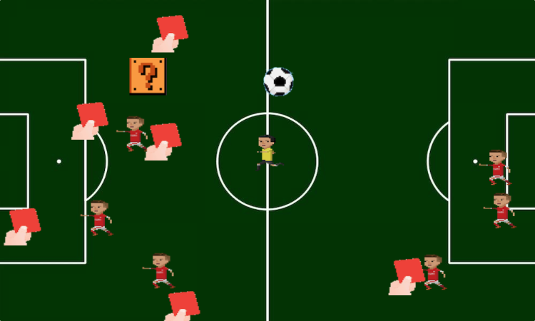

# Angry Referee
## Background and Overview
Angry Referee is a single-player game. The objective of the game is to collect
the red cards while avoiding the players and the ball. Running into a defender 
or the ball will end the game. Collecting a mystery block may slow or speed up 
the opponents and ball. In order to win, the referee must collect all of the red
cards and not collide with the ball or any of the players.

## Functionality & MVP Features
* Users are able to manipulate the speed and direction of the referee.
* Users are able to alter the difficulty of the game with a mystery power-up.

## Architecture and Technologies
The project was implemented using the following technologies:
* `JavaScript` for the overall structure and logic of the game.
* `HTML5 Canvas` for rendering.

## Implementation Timeline
8/18
* Make the base of the game. This will include the field and movement mechanics
of the referee, opponents, and other moving objects. 

8/19
* The spawning mechanics of defenders will be added and power-ups will be implemented.

8/20 
* Implement collision detection algorithm for all moving objects.

8/21
* Improve visuals and iron out the remainder of the project.